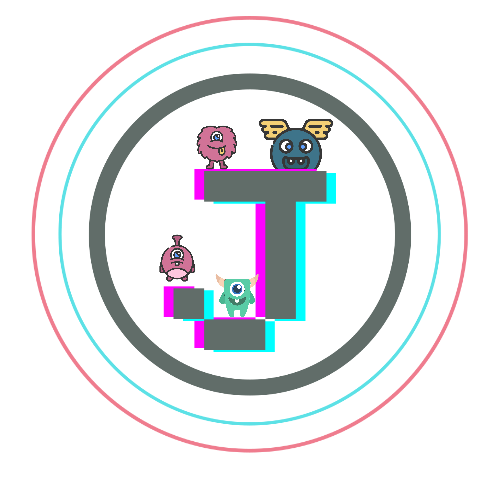

<html>
  <head>
    <!-- CSS link -->
    <link rel="stylesheet" type="text/css" href="style.css">
    <title>JessStream</title>
    <!-- meta space -->
        <meta charset="UTF-8">
    <meta http-equiv="X-UA-Compatible" content="IE=edge">
    <meta name="viewport" content ="width=device-width, initial-scale=1" />
    <link rel = "icon" href ="logo.png" sizes="16x16" type = "image/x-icon">
          
 </head>
<body>
  <button onclick="topFunction()" id="myBtn" title="Go to top">Top</button>
 <header class="site-header">
  

    
    <h1>Jessie Streaming service 100M mbps</a></h1>
  
  
  <nav class="site-navigation">
    <ul class="nav"><!-- <ul class="nav"> -->

      <li><a href="#About Us & Goals">About Us & Goals</a></li> 
      <li><a href="#Time Schedule">Time Schedule</a></li>
      <li><a href="#Promotional plan">Promotional plan</a></li> 
      <li><a href="#Members">Members list</a></li>
    </ul>
  </nav><!-- </nav> -->
</header>

    <!-- parallax -->
    

    

      
      <p1>Charge with your spirit</p1> <p1>
      <p1>Fire your bullet</p1>
        <p1>Welcome you</p1> 

 

<!-- /paralax -->

<section>

<h4 id="About Us & Goals">About Us</h4> 

  
Welcome to our site! This stream is made for gaming.  We chose gaming as our streaming content since a lot of people nowadays mostly young adolescents and teenagers like to play a lot. With that, we would like to bring positivity and entertain people on how we enjoy playing games. This streaming site is used for delivering such informations and joy to people who love to play a lot.

  
    
  </section>
     

<section2>

  <h6><b>Jesse streaming service has 5 goals and that is
First To make everyone happy.</b></h6>
  

<h2>1. SPREAD THE HAPPINESS</h2>
  

<h2>2. MAKE MORE FRIENDS</h2>
  

<h2>3. HELP THE VIWERS TO INTERACT WITH THE STREAMER</h2>
  

<h2>4. HELP THEM ABOUT THE GAME THAT WE ARE PLAYING</h2>
  

<h2>5. ENTERTAIN THE VIEWERS</h2>
</section2>

  

<h3 id="Time Schedule">Time schedule</h3>
<section1>
<p2><b>This is the schedule of events that will happen in our stream that will start from 9:00am to 11:10 am. See you there!</b></p2> 

</section1>
<table>
<tr>
  <th>Time</th>
    <th>Topic</th>
      <th>Activity</th>
        <th>Time Allotment (mins)</th>
          <th>Screen</th>
            <th>Audio</th>
          </tr>
          
          <tr>
            <td>9:00 - 9:15</td>
            <td>Introduction</td>
            <td>Get to know the members and a small introduction about the topic/content. </td>
            <td>15</td>
            <td>Overlay</td>
            <td>Video Audio/mic</td>
          </tr>

          <tr>
            <td>9:15 - 9:20</td>
            <td>Ice breaker (Quiz about streamer spoke)</td>
            <td>A short entertainment for the audiences </td>
            <td>5</td>
            <td>Video</td>
            <td>Video</td>
          </tr>

          <tr>
            <td>9:20 - 10:05</td>
            <td>Start of Streaming</td>
            <td>Deliver the excitement with the audience. </td>
            <td>45</td>
            <td>Video</td>
            <td>Video Audio/mic</td>
          </tr>

          <tr>
            <td>10:05 - 10:15</td>
            <td>Interacting with viewers</td>
            <td>Chatting while playing, answering the questions from viewers</td>
            <td>10</td>
            <td>Video</td>
            <td>Video Audio/mic</td>
          </tr>

          <tr>
            <td>10:15 - 10:30</td>
            <td>Break</td>
            <td>Take time to rest, water break or bathroom break.</td>
            <td>15</td>
            <td>Overlay</td>
            <td>Game Sound / Background Music</td>
          </tr>

          <tr>
            <td>10:30 - 10:55</td>
            <td>Resume of Streaming</td>
            <td>Deliver the excitement with the audience. </td>
            <td>25</td>
            <td>Video</td>
            <td>Audio/mic</td>
          </tr>
        </table>
 

  

  

      
<h5 id="Promotional plan">Promotional plan</h5>
 
<p3>Streaming platform will be:</p3>
 
 
 
<section3>
  <figure>

<figcaption>Youtube</figcaption>
</figure>

<figure>

<figcaption>Facebook</figcaption>
</figure>

<figure>

<figcaption>Twitch</figcaption>
</figure>

</section3>
     
  
<section4>
  
     

</section4>
<section5>
<p4 style="text-align: center"><b>So this is the poster that we are going to use this poster represents.</b>  <p4 style="text-align: center"><b>The thing that we are going to do in our stream which is gaming the person on that poster is one of our members he represents it he is the main view of our stream. </b> <b>And the background of it is the galaxy we actually thought that the galaxy will be much better because it kinda represents the gaming vibes.</b></p4></section5>

                  

  
  
<h3 id="Members">   Group 2</h3>  
<section6>
  
Members list
  

Psalm Fernandez
 

Andrei Labor
 

Daguil Jessie
 

Alfredo Francisco
 

Gabrielle Mancilla
 

Pierre Gan
 

  </body>
</html>
